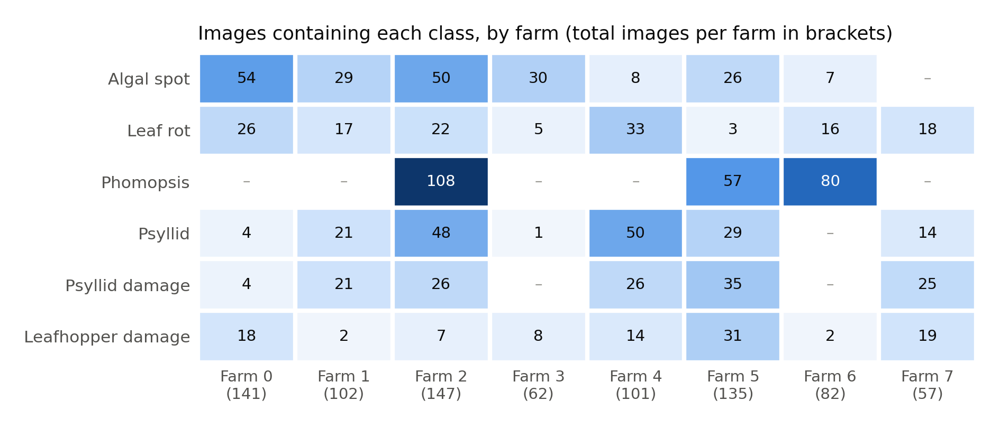
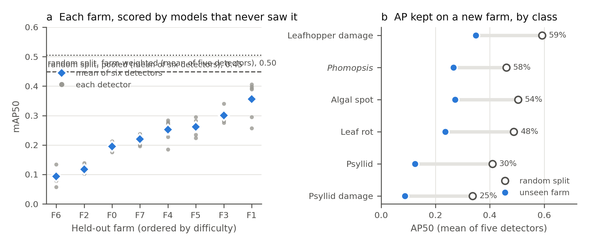
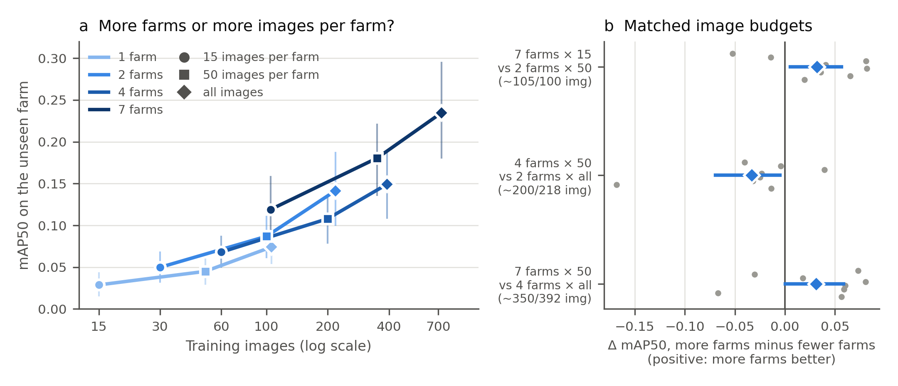
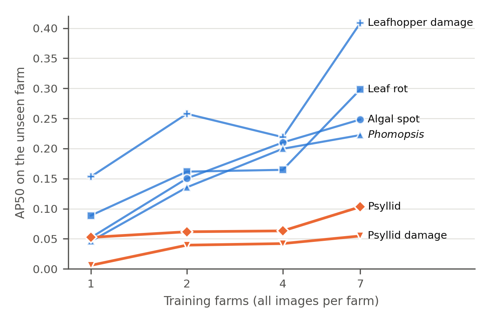
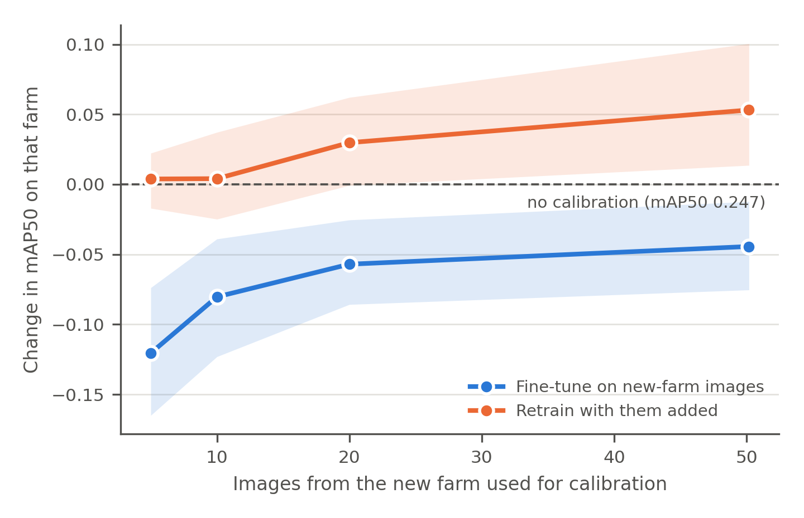

# What a new orchard costs: farm-level generalisation and data budgets for durian disease and pest detection

**Lin Ding Shan**

Faculty of Computer Science (Data Science), UCSI University, Kuala Lumpur, Malaysia

Corresponding author: Lin Ding Shan, 1002475487@ucsiuniversity.edu.my, ORCID 0009-0009-6031-8479

## Abstract

Durian (*Durio zibethinus*) disease and pest detectors are used on farms absent from their training data, yet are commonly scored on a random split of images from the training farms. We measured the gap on {{farms/images}} annotated images ({{farms/images_with_boxes}} with lesion boxes) from {{farms/n_farms:w}} commercial farms in Peninsular Malaysia and {{sabah_images}} from two orchards in Sabah. With each held-out farm excluded from training, early stopping and checkpoint selection, six detectors scored {{headline_range/ratio_min:.1f}}–{{headline_range/ratio_max:.1f}} times lower mAP50 on unseen farms than on a random split; YOLO11n fell from {{headline/yolo11n/random_split:.3f}} to {{headline/yolo11n/unseen_farm:.3f}}. The held-out farm mattered more than the detector: per-farm scores spanned {{per_farm/min:.3f}}–{{per_farm/max:.3f}}, whereas the six detectors' mean scores differed by at most {{model_pairs/max_abs_mean_diff:.3f}}. Psyllid and psyllid damage kept {{per_class_summary/psyllid_retained_range/0:.0f}}–{{per_class_summary/psyllid_retained_range/1:.0f}}% of their random-split AP on unseen farms; the other classes kept {{per_class_summary/other_retained_range/0:.0f}}–{{per_class_summary/other_retained_range/1:.0f}}%. In {{rq2_design/runs}} training runs with a fixed number of iterations that varied the number of training farms (1, 2, 4 or 7) and images per farm (15, 50 or all), doubling farms raised unseen-farm mAP50 by {{regression/all runs/farms:.3f}} and doubling images per farm by {{regression/all runs/photos:.3f}}, a difference within the uncertainty. {{abstract_rq3_sentence}} Orchard detectors should be evaluated on held-out farms, collections should first cover the region's farms and classes, and a new farm's images belong in the training data, not in fine-tuning alone.

**Keywords:** Durian; Plant disease detection; Insect pest detection; Object detection; Domain shift; Leave-one-farm-out validation; Training data collection

## 1. Introduction

Durian is a high-value fruit crop across Southeast Asia (O'Gara et al., 2004), and its leaf, stem and trunk diseases and insect pests are commonly identified in the field from their visible symptoms. A handheld device that photographs a leaf or trunk and suggests which disease or pest is present could shorten the time between a symptom appearing and a grower acting on it. Such a device is used by growers whose farms were not in its training data, so the number that matters to them is how well the detector works on a farm it has never seen.

That number is not always the one reported. Plant-disease detectors are often evaluated on a random partition of one pool of images, so that images from the same farm, and often from the same tree, appear on both sides of the split. The consequences of mismatched evaluation are documented in general terms. Models trained on laboratory images of single leaves lose most of their accuracy on images from other sources (Mohanty et al., 2016), limited variety in training data is a principal barrier to field use (Barbedo, 2018a, 2018b), and training on in-the-wild images improves field performance (Singh et al., 2020). In camera-trap ecology, where the unit is a camera location, accuracy at locations absent from training is consistently lower than at trained locations (Beery et al., 2018; Tabak et al., 2019; Schneider et al., 2020; Norman et al., 2023), and benchmarks of in-the-wild distribution shift show the same pattern for wheat-head detection across acquisition domains (Koh et al., 2021). Grouped or blocked validation is the standard remedy for spatially structured data (Roberts et al., 2017), and evaluating on data that share structure with the training set is a recognised form of leakage (Kapoor and Narayanan, 2023).

Three practical questions follow for a team building a detector for a new crop. The first is how large the gap between a random split and an unseen farm is for multi-class, lesion-level detection of orchard diseases and pests, and whether it falls evenly across classes. The second is how a limited collection budget should be spent: on more farms, or on more images from each farm. For camera traps, a supplementary experiment of Beery et al. (2018) found that accuracy at new locations was stable once more than two training locations were used. For weed detection in arable fields, Ruigrok et al. (2023) found that, at a constant number of training images, drawing them from more sub-datasets improved generalisation, that more images from the same sub-datasets helped only when they added new variation, and that fine-tuning on images from the new field reduced the remaining error, by about 90% on average with around 300 images. The third question is therefore whether a few images taken on arrival at a new farm recover what the change of farm costs. None of these has been measured for disease and pest detection in orchards, where the targets are small lesions and insects and where each farm carries only some of the classes. They cannot be measured on most public plant-disease datasets, which do not record where each image was taken (Xu et al., 2024), and the durian datasets released to date either come largely from one family orchard (Nguyen, 2025) or do not describe a per-image orchard identifier (Nguyen Thanh et al., 2025). A recent durian pest-and-disease detector was developed and evaluated at a single site (Tang et al., 2025).

This paper answers the three questions on a durian corpus in which every image carries its farm. Its contributions are:

1. A measurement of the unseen-farm gap for six detectors from three architecture families, with each held-out farm excluded from every training decision, broken down by farm and by class, and repeated on two orchards on another island.
2. A controlled experiment of {{rq2_design/runs}} training runs, all trained for the same number of iterations, that varies the number of training farms and the number of images per farm independently.
3. An experiment on calibrating a trained detector to a new farm with 5–{{rq3_max_images:.0f}} images from that farm, by fine-tuning and by retraining.
4. A released dataset with farm identifiers and split manifests, and code that recomputes every number reported here.

## 2. Materials and methods

### 2.1. Study sites and image collection

Images were taken at commercial durian farms in Selangor, Negeri Sembilan and the Muar district of Johor between December 2025 and July 2026, and at two orchards near Lahad Datu, Sabah, on 13–16 August 2026. The peninsular collection comprises nine sites, of which the {{farms/n_farms:w}} holding at least 20 annotated images form the analysis pool (Table 1). The peninsular farms lie within 134 km of one another and are separate operations under different managers. The Sabah orchards, 1,765–1,872 km away, are an 8.1 ha mature planting under one manager and a separate 3.6 ha planting; {{sabah_orchard_images/sabah_o1}} of the {{sabah_images}} annotated Sabah images come from the first and {{sabah_orchard_images/sabah_o2}} from the second. All images were captured hand-held under natural light by one person, primarily on an iPhone 16 Pro Max; an iPhone 13 Pro was used at three farms and an iPhone 13 for two images at a fourth. Six focal lengths occur (2.22–15.66 mm) and every farm mixes at least two. {{capture/farms_single_date:W}} of the {{farms/n_farms:w}} peninsular farms were photographed on a single day and {{capture/farms_two_dates:w}} on two, so in this corpus a farm is also, largely, a visit. Images were resized to 640 × 640 pixels for training and are released at that resolution. In this paper *farm* denotes a peninsular commercial farm and *orchard* one of the two Sabah plantings.

### 2.2. Classes and annotation

Six classes were annotated at lesion level, one box per visible lesion or insect: algal spot, leaf rot, *Phomopsis*, psyllid, psyllid damage and leafhopper damage. The class list mixes symptom names with a fungal genus because these are the names growers and extension services use and under which fungicides are registered. The annotation standard was calibrated in the field with a crop-protection practitioner of several decades' regional experience, annotation was outsourced per class against that standard, and every image was reviewed by the author. Inter-annotator agreement was not measured. Classes are unevenly distributed across farms (Fig. 1, Table 1): *Phomopsis* occurs on only {{farms/farms_per_class/Phomopsis:w}} of the {{farms/n_farms:w}} farms, and each farm carries between {{farms/classes_present_min:w}} and {{farms/classes_present_max:w}} of the six classes. The {{farms/images}} images in the pool contain {{farms/boxes:,}} boxes; {{farms/images_without_boxes}} images show no annotated symptom.

{width=16cm}

**Fig. 1.** Number of images containing each class on each of the eight peninsular farms (total images per farm in brackets); a dash marks a class absent from the farm. Farms differ both in size and in which diseases and pests they carry.

[[TABLE:table1]]

### 2.3. Farm attribution

Farm identity was recovered for each original photograph from its EXIF location by single-link clustering at 1.5 km; originals without location were attributed to the farm of the nearest located image taken within 30 minutes on the same day. Each annotated image was then matched to its original by a 64-bit difference hash, accepted only when no original from a different farm lay within three bits, and assigned that original's farm. This attributed 829 of 1,033 annotated peninsular images; the {{farms/n_farms:w}} farms with at least 20 images hold the {{farms/images}} used here. An earlier attribution that joined images to their metadata by filename had placed 50 images (8.9% of the pool at the time) under the wrong farm, because two field visits produced overlapping camera counters; the error was invisible in the pooled scores and was found only because the original photographs had been kept (Note S2).

### 2.4. Detectors

The handheld device runs YOLO11n (Jocher and Qiu, 2024) exported to ONNX on a Raspberry Pi 5, offline, as a decision aid used on demand; the device itself is not evaluated here. To test whether the conclusions depend on that choice, five further detectors were trained and evaluated under the same protocol: YOLO11s, YOLO11m and YOLO11l; RT-DETR-L, a transformer-based real-time detector (Zhao et al., 2024); and Faster R-CNN, a two-stage anchor-based detector sharing no code with the others, in torchvision's ResNet-50 FPN v2 configuration (Ren et al., 2017; Li et al., 2021b). The Ultralytics detectors were COCO-pretrained and trained at 640 px for up to 150 epochs with patience 50, default augmentation and five seeds. Faster R-CNN was fine-tuned from COCO weights with its own training loop (SGD, learning rate 0.005, momentum 0.9, weight decay 5 × 10⁻⁴, cosine annealing, horizontal flips, torchvision's default input resizing, 40 epochs, patience 12, batch 4, three seeds), so its augmentation and input size differ from those of the Ultralytics detectors. mAP50, the mean over classes of average precision at an intersection-over-union threshold of 0.5 (Lin et al., 2014), is the primary metric; Faster R-CNN was scored with torchmetrics' implementation of the same COCO definition, so its comparison with the other five carries additional implementation uncertainty.

### 2.5. Evaluation protocol

**Unseen farm.** Each of the {{farms/n_farms:w}} farms was held out in turn (leave-one-farm-out) and the detector was trained on the other seven. The held-out farm entered no training decision: early stopping and checkpoint selection used an inner validation set of 10% of the training images, stratified by each image's dominant class and drawn with a fixed seed, and the held-out farm was scored once, after training ended. This matters in practice. Widely used detection frameworks score the validation split every epoch and keep the best-scoring weights, so passing the held-out farm to the trainer as its validation set lets that farm choose the checkpoint (Varma and Simon, 2006; Cawley and Talbot, 2010). In an earlier run of the same experiment in which the held-out farm served as the validation set, the gap between random split and unseen farm for YOLO11n appeared as {{checkpoint_leakage_yolo11n/drop_pct_if_heldout_selects}}% rather than {{checkpoint_leakage_yolo11n/drop_pct_clean}}%; that run also trained on all rather than 90% of the training images, so the {{checkpoint_leakage_yolo11n/understated_by_points}}-point difference is not due to checkpoint selection alone.

**Random split.** For comparison, the same pool was split once at random into 80% training and 20% test images ({{random_test_images}} images), stratified by dominant class, with the same inner-validation rule. This is the figure a conventional evaluation reports: one mAP50 computed over the pooled test images.

**Aggregation.** The unseen-farm score of a detector is the mAP50 of each held-out farm's images, averaged over seeds, and then averaged over farms with equal weight, because a new customer is a farm rather than an image. Each farm's mAP50 averages only the classes present on that farm. Because the conventional random-split figure is pooled over farms and classes, the random-split models were also scored on the test images of each farm separately and averaged in the same way (farm-weighted random split).

**Another island.** Every leave-one-farm-out model of the five Ultralytics detectors was also scored on each of the two Sabah orchards, which never entered any training set.

### 2.6. Data-budget experiment

To separate the effect of how many farms supply the training data from the effect of how many images each farm supplies, YOLO11n was retrained under a factorial design. For each held-out farm, *k* ∈ {1, 2, 4, 7} training farms were drawn from the other seven, and *m* ∈ {15, 50, all} images were drawn at random from each drawn farm. For *k* < 7, two different farm combinations were drawn; for *k* = 7 there is only one. Within a combination the three image counts are nested (15 ⊂ 50 ⊂ all), so comparisons between them are paired. The design gives {{rq2_design/configs}} training sets over {{rq2_design/heldout_farms:w}} held-out farms, each trained with {{seed_count_word}} ({{seed_list}}).

Every run was trained for the same number of iterations, so that a comparison between budgets compares data rather than training length. The batch size was 32 in every run (with the Ultralytics default of accumulating gradients over two batches, a nominal batch of 64); the list of training images was repeated as often as needed for each epoch to contain at least 20 batches; and the number of epochs was set to give about 2,000 iterations ({{rq2_design/iterations_min:,}}–{{rq2_design/iterations_max:,}} in practice, about 1,000 optimiser steps). Mosaic augmentation was switched off for the last 10% of epochs. Because 10% of 15 images is too few for a meaningful stopping signal, no validation set, early stopping or checkpoint selection was used: the final weights were evaluated once on the held-out farm and on each Sabah orchard. The held-out farm therefore entered no part of training. An earlier run of this experiment capped training at 300 epochs, which gave the smallest budgets far fewer iterations than the largest; its results are reported for comparison in Table S7.

### 2.7. New-farm calibration experiment

To test how much a few images from the target farm recover, each held-out farm's images were ordered by capture time and split into halves, with three images discarded at the boundary so that a burst of images of one tree cannot fall on both sides; one half served as the calibration pool and the other as the test set, and the roles were then swapped. From the calibration pool, *n* ∈ {5, 10, 20, all} images were drawn at random (nested). The starting model was the data-budget model trained on all images of the other seven farms. Two ways of using the calibration images were compared, each with a fixed optimisation budget and no checkpoint selection: fine-tuning the starting model on the calibration images alone (backbone frozen, AdamW, learning rate 5 × 10⁻⁴, no warm-up, batch 16 without gradient accumulation, {{rq3_ft_steps}} optimiser steps), and retraining from COCO weights on the other seven farms plus the calibration images under the protocol of Section 2.6. Both were scored on the same test half as the uncalibrated starting model. Fine-tuning was run with {{rq3_ft_seed_word}} and retraining with {{rq3_rt_seed_word}}.

### 2.8. Statistical analysis

All summaries average within a held-out farm first (over draws, seeds and, for calibration, the two halves) and then over farms with equal weight. Intervals are 90% percentile bootstrap intervals over held-out farms (4,000 resamples). With eight farms, and with training sets that share farms across held-out farms, these intervals are approximate and probably too narrow; they describe the spread across farms rather than serve as tests. Paired comparisons are computed per held-out farm and then bootstrapped, and the number of farms on which the comparison favours one side is reported alongside.

To summarise the data-budget design, unseen-farm mAP50 was regressed on log₂ *k* and log₂ (images per farm) with a fixed effect for each held-out farm, fitted to all {{rq2_design/runs}} runs; the two slopes are the expected change in mAP50 per doubling of the number of farms at fixed images per farm, and per doubling of images per farm at fixed farms. Because a log-linear form can hide uneven steps, the individual steps (one to two, two to four and four to seven farms; 15 to 50 and 50 to all images per farm) are also reported as paired contrasts (Table S6). For each training set we computed its class coverage: the share of the held-out farm's annotated images whose classes all occur in the images actually drawn for training. A detector cannot find a class it was never shown, so coverage indicates how much of the value of a farm lies in the classes it carries; it was added to the regression as a covariate and used to restrict it.

## 3. Results

### 3.1. The unseen-farm gap

On a random split the six detectors reached {{headline_range/random_min:.3f}}–{{headline_range/random_max:.3f}} mAP50; on farms they had never seen they reached {{headline_range/unseen_min:.3f}}–{{headline_range/unseen_max:.3f}} (Table 2), {{headline_range/ratio_min:.2f}}–{{headline_range/ratio_max:.2f}} times lower. The loss was {{headline_range/drop_one_stage_min}}–{{headline_range/drop_max}}% for the four YOLO11 sizes and RT-DETR-L and {{headline/frcnn-r50/drop_pct}}% for Faster R-CNN, whose random-split figure was the lowest of the six. YOLO11n, the deployed model, fell from {{headline/yolo11n/random_split:.3f}} to {{headline/yolo11n/unseen_farm:.3f}}. {{random_farm_weighted_sentence}} Nor does it come from class composition alone: every class lost AP on unseen farms when compared class by class (Section 3.3).

[[TABLE:table2]]

### 3.2. The farm, not the detector, sets the difficulty

Scored one farm at a time and averaged over the six detectors, unseen-farm mAP50 ranged from {{per_farm/min:.3f}} to {{per_farm/max:.3f}}, a {{per_farm/ratio_best_worst}}-fold spread (Fig. 2a; Table S1). The detectors largely agreed on which farms were hard: the mean pairwise Spearman correlation of their farm rankings was {{per_farm/mean_pairwise_spearman:.2f}} (lowest pair {{per_farm/min_pairwise_spearman:.2f}}), and all six placed farms {{per_farm/two_worst/0}} and {{per_farm/two_worst/1}} last. Averaged over farms, no two detectors differed by more than {{model_pairs/max_abs_mean_diff:.3f}} mAP50, and YOLO11n was {{detector_gap/yolo11n_below_best:.3f}} below the best; on individual farms they differed by up to {{per_farm/max_range_within_farm:.3f}}, but the best detector changed from farm to farm and none was best on more than {{per_farm/max_farms_won_by_one_detector:w}} of the {{farms/n_farms:w}}. A variance decomposition over five detectors × eight farms × five seeds attributed {{variance_shares/unit}}% of the variance of the per-farm score to the held-out farm, {{variance_shares/interaction}}% to the farm × detector interaction and {{variance_shares/seed}}% to the residual, which includes seed-to-seed variation; the detector component was estimated as negative and is reported as {{variance_shares/model}}%.

{width=16cm}

**Fig. 2.** The unseen-farm gap. (a) Unseen-farm mAP50 of each peninsular farm, ordered by difficulty; grey points are the six detectors, blue diamonds their mean, and the dashed line is the mean pooled random-split figure. (b) Per-class AP50 on a random split (open circles) and on unseen farms (filled), averaged over the five detectors that report per-class AP; the percentage is the share retained. For each class, unseen-farm AP is averaged over the farms that carry it.

### 3.3. Psyllid classes transfer worst

Compared class by class, every class lost AP on unseen farms, but not equally (Fig. 2b, Table 3). Psyllid and psyllid damage retained {{per_class/Psyllid/retained_pct:.0f}}% and {{per_class/Psyllid_damage/retained_pct:.0f}}% of their random-split AP, against {{per_class_summary/other_retained_range/0:.0f}}–{{per_class_summary/other_retained_range/1:.0f}}% for leaf rot, algal spot, *Phomopsis* and leafhopper damage. The per-class figure on a single farm is noisy when that farm holds few examples of the class, so the calculation was repeated using only farms with at least 10 images of the class: psyllid and psyllid damage then retained {{per_class_sensitivity_min10/Psyllid/retained_pct:.0f}}% and {{per_class_sensitivity_min10/Psyllid_damage/retained_pct:.0f}}%, and the other classes {{sens_other_min:.0f}}–{{sens_other_max:.0f}}%. The ordering was unchanged (Table S2 gives every class on every farm).

[[TABLE:table3]]

### 3.4. More farms or more images per farm

{{rq2_results_opening}}

[[TABLE:table4]]

{{rq2_steps_paragraph}}

{{rq2_matched_paragraph}}

{width=16cm}

**Fig. 3.** How the training budget is spent (YOLO11n, fixed number of iterations). (a) Unseen-farm mAP50 against the number of training images, for training sets drawn from 1, 2, 4 or 7 farms with 15, 50 or all images per farm; vertical bars are 90% bootstrap intervals over held-out farms. (b) Paired differences at three matched image budgets; grey points are held-out farms, blue diamonds and bars the mean and its 90% interval.

[[TABLE:table5]]

{{rq2_coverage_paragraph}}

### 3.5. Which classes gain from more farms

{{rq2_classes_paragraph}}

{width=12cm}

**Fig. 4.** Unseen-farm AP50 of each class against the number of training farms, with all images per farm (YOLO11n), averaged over the held-out farms that carry the class. The seven-farm point is a single farm combination per held-out farm; the others average two.

### 3.6. Calibrating to a new farm

{{rq3_results_paragraph}}

{width=12cm}

**Fig. 5.** Change in mAP50 on the test half of a new farm when a detector trained on the other seven farms is calibrated with images from the calibration half, by fine-tuning (blue) or by retraining with them added (orange); bands are 90% bootstrap intervals over farms.

[[TABLE:table6]]

### 3.7. Another island

{{sabah_paragraph}}

## 4. Discussion

### 4.1. What an orchard detector should report

For every detector tested, a random split of images from the training farms overstated unseen-farm accuracy by a factor of {{headline_range/ratio_min:.1f}} to {{headline_range/ratio_max:.1f}}. The factor is a property of the corpus: it depends on how much farms differ and on how many near-duplicate images a random split places on both sides. In this corpus most farms were photographed on a single visit, so the gap combines a change of farm with a change of day, light and season; whichever dominates, a grower's farm differs from the training data in both respects. The corresponding practice is simple: hold out whole farms, keep the held-out farm out of early stopping and checkpoint selection, and report the spread across farms alongside the mean. With a {{per_farm/ratio_best_worst}}-fold range between the easiest and hardest farm, the mean alone says little about what a detector will do on a particular farm.

The held-out farm mattered more than the detector. Six detectors from three architecture families differed on average by at most {{model_pairs/max_abs_mean_diff:.3f}} mAP50 across the same farms, far less than the farms differed from one another. That does not make them equivalent, and eight farms cannot establish equivalence; but for a device the difference between them is small enough that latency, energy and memory can reasonably decide.

### 4.2. How to spend a collection budget

{{discussion_budget_paragraph}}

### 4.3. Why the psyllid classes transfer worst

The two psyllid classes kept roughly a quarter to a third of their random-split AP on unseen farms and remained the lowest classes with every number of training farms. Size alone does not explain this. Psyllid and psyllid-damage boxes are small (a typical side of about {{box_side_px/Psyllid:.0f}} and {{box_side_px/Psyllid_damage:.0f}} pixels at 640 × 640), but *Phomopsis* lesions are as small (about {{box_side_px/Phomopsis:.0f}} pixels) and kept {{per_class/Phomopsis/retained_pct:.0f}}% of their AP. Plausible contributors are that the two psyllid classes co-occur and resemble each other, so that the boundary between them is partly an annotation convention; that the appearance of an infestation changes with its stage, which differs between farms visited at different times; and that insect detection is difficult even within one domain (Wu et al., 2019; Li et al., 2021a). The data do not distinguish these. The practical consequence is that a device's psyllid suggestions deserve less weight than its disease suggestions on a farm outside its training set, and that the psyllid classes are where a revised class definition, a close-up capture protocol or additional labelled data would be worth testing first.

{{discussion_rq3_section}}

### 4.5. Limitations

The corpus has eight peninsular farms and two Sabah orchards, all photographed by one person, mostly on one visit per farm, so farm and visit cannot be separated. The class composition differs sharply between farms: five held-out farms carry no *Phomopsis*, so its per-class figure rests on three. Inter-annotator agreement was not measured, and any bias in the annotation standard could interact with farm composition. Per-class figures on individual farms are noisy where a class has few examples; the ordering was stable when such farms were excluded, but the magnitudes moved. The experiments on training data used one detector, two farm draws per budget (which differed by a median of {{checks/median_draw_spread:.3f}} mAP50 on the same held-out farm; Table S5) and {{seed_count_word}} per configuration; the seed-to-seed standard deviation of a leave-one-farm-out YOLO11n score on a single farm averaged {{seed_sd_yolo11n_per_farm:.3f}} mAP50, comparable to several of the paired differences, so per-farm win counts should be read with that in mind. The seven-farm training sets are a single combination per held-out farm, and the fixed number of iterations is a choice rather than a neutral default. The bootstrap intervals resample eight farms that share training data and are approximate. All results are offline evaluations of images; the device's latency and energy, and how growers act on its suggestions, were not measured here.

## 5. Conclusions

On durian farms that a detector never saw, mAP50 was {{headline_range/ratio_min:.1f}}–{{headline_range/ratio_max:.1f}} times lower than a random image split reported, for six detectors from three architecture families. The held-out farm, not the detector, determined most of the score, and the psyllid classes transferred worst. {{conclusion_budget_sentence}} {{conclusion_rq3_sentence}} Orchard detectors should be evaluated on held-out farms with the held-out farm excluded from every training decision, and collection campaigns should be planned around the farms and classes of the target region as well as the number of images.

## Supplementary material

Supplementary material (Tables S1–S7, Notes S1–S2) is available online.

## CRediT authorship contribution statement

**Lin Ding Shan:** Conceptualization, Methodology, Software, Validation, Formal analysis, Investigation, Data curation, Writing – original draft, Writing – review & editing, Visualization, Project administration.

## Declaration of competing interest

The author is developing a handheld decision-support device for durian disease and pest scouting and has a potential financial interest in the domain this study evaluates. Access to the Sabah orchards was facilitated by a commercial partner who had no role in study design, data collection, annotation, analysis or the decision to publish, and provided no funding, products or data.

## Funding

This research did not receive any specific grant from funding agencies in the public, commercial, or not-for-profit sectors.

## Ethics statement

The study is principally computational analysis of plant images. Two adult growers were consulted about their professional practice; informed consent was obtained verbally and recorded at the time, and both have since confirmed in writing. No names, farm names, locations or other identifying information appear.

## Data availability

The durian images and annotations are deposited on Zenodo ({{zenodo_data_doi}}; CC BY-NC 4.0) at 640 × 640 pixels with location coordinates removed, together with the content-based farm attribution and all split manifests; the {{farms/images}}-image analysis pool and the {{sabah_images}}-image Sabah set are identified in the manifests.

## Code availability

Training, evaluation and analysis code, the result tables behind every figure and table, and a script that recomputes every number in this paper from those tables are available at https://github.com/xiaolin200206/durian-site-split ({{zenodo_code_doi}}).

## Relation to prior work by the same author

The peninsular images derive from the same collection as an earlier study of capture-session leakage in five-class image classification (under review; https://doi.org/10.5281/zenodo.22177133), which partitions 560 images into 73 capture sessions and reports macro F1. The present work uses box-level annotation, content-based farm attribution, 827 images across eight farms, detection models, a different unit and evaluation protocol, and experiments on training-data budgets and new-farm calibration that the earlier study does not contain. The leave-one-farm-out runs of Sections 3.1–3.3 were also analysed, together with three non-agricultural datasets, in a methodological manuscript that was withdrawn before review; the present paper replaces it for the durian results.

## Acknowledgements

The author thanks the collaborating grower in Johor, who set the symptom-recognition standard in the field, and the orchard manager in Lahad Datu for access to the Sabah site.

## Declaration of generative AI and AI-assisted technologies in the manuscript preparation process

During the preparation of this work the author used Claude (Anthropic) to draft and audit analysis scripts operating on the released result tables, to edit and restructure the manuscript, and to locate candidate references. All fieldwork, image capture, annotation review, class definition, protocol design and model training were carried out by the author, who reviewed every script and its output and re-ran each on the released data. After using this tool, the author reviewed and edited the content as needed and takes full responsibility for the content of the published article.

## References

Barbedo, J.G.A., 2018a. Impact of dataset size and variety on the effectiveness of deep learning and transfer learning for plant disease classification. Comput. Electron. Agric. 153, 46–53. https://doi.org/10.1016/j.compag.2018.08.013

Barbedo, J.G.A., 2018b. Factors influencing the use of deep learning for plant disease recognition. Biosyst. Eng. 172, 84–91. https://doi.org/10.1016/j.biosystemseng.2018.05.013

Beery, S., Van Horn, G., Perona, P., 2018. Recognition in terra incognita, in: Computer Vision – ECCV 2018, Lecture Notes in Computer Science 11220. Springer, Cham, pp. 472–489. https://doi.org/10.1007/978-3-030-01270-0_28

Cawley, G.C., Talbot, N.L.C., 2010. On over-fitting in model selection and subsequent selection bias in performance evaluation. J. Mach. Learn. Res. 11, 2079–2107.

Jocher, G., Qiu, J., 2024. Ultralytics YOLO11, version 11.0.0 [software]. https://github.com/ultralytics/ultralytics

Kapoor, S., Narayanan, A., 2023. Leakage and the reproducibility crisis in machine-learning-based science. Patterns 4, 100804. https://doi.org/10.1016/j.patter.2023.100804

Koh, P.W., Sagawa, S., Marklund, H., et al., 2021. WILDS: a benchmark of in-the-wild distribution shifts, in: Proceedings of the 38th International Conference on Machine Learning, PMLR 139, pp. 5637–5664.

Li, W., Wang, D., Li, M., Gao, Y., Wu, J., Yang, X., 2021a. Field detection of tiny pests from sticky trap images using deep learning in agricultural greenhouse. Comput. Electron. Agric. 183, 106048. https://doi.org/10.1016/j.compag.2021.106048

Li, Y., Xie, S., Chen, X., Dollár, P., He, K., Girshick, R., 2021b. Benchmarking detection transfer learning with vision transformers. arXiv:2111.11429. https://doi.org/10.48550/arXiv.2111.11429

Lin, T.-Y., Maire, M., Belongie, S., et al., 2014. Microsoft COCO: common objects in context, in: Computer Vision – ECCV 2014, Lecture Notes in Computer Science 8693. Springer, Cham, pp. 740–755. https://doi.org/10.1007/978-3-319-10602-1_48

Mohanty, S.P., Hughes, D.P., Salathé, M., 2016. Using deep learning for image-based plant disease detection. Front. Plant Sci. 7, 1419. https://doi.org/10.3389/fpls.2016.01419

Nguyen, T., 2025. Image dataset of ten durian diseases captured in real-field conditions from a family orchard in Vinh Long, Vietnam. Data Brief 63, 112244. https://doi.org/10.1016/j.dib.2025.112244

Nguyen Thanh, T., Nguyen, L.X., Cap, T., Le, T., 2025. A durian leaf image dataset of common diseases in Vietnam for agricultural diagnosis. Data Brief 61, 111845. https://doi.org/10.1016/j.dib.2025.111845

Norman, D.L., Bischoff, P.H., Wearn, O.R., et al., 2023. Can CNN-based species classification generalise across variation in habitat within a camera trap survey? Methods Ecol. Evol. 14, 242–251. https://doi.org/10.1111/2041-210X.14031

O'Gara, E., Guest, D.I., Hassan, N.M., 2004. Botany and production of durian (*Durio zibethinus*) in Southeast Asia, in: Drenth, A., Guest, D.I. (Eds.), Diversity and Management of *Phytophthora* in Southeast Asia, ACIAR Monograph No. 114. Australian Centre for International Agricultural Research, Canberra, pp. 180–186.

Ren, S., He, K., Girshick, R., Sun, J., 2017. Faster R-CNN: towards real-time object detection with region proposal networks. IEEE Trans. Pattern Anal. Mach. Intell. 39, 1137–1149. https://doi.org/10.1109/TPAMI.2016.2577031

Roberts, D.R., Bahn, V., Ciuti, S., et al., 2017. Cross-validation strategies for data with temporal, spatial, hierarchical, or phylogenetic structure. Ecography 40, 913–929. https://doi.org/10.1111/ecog.02881

Ruigrok, T., van Henten, E.J., Kootstra, G., 2023. Improved generalization of a plant-detection model for precision weed control. Comput. Electron. Agric. 204, 107554. https://doi.org/10.1016/j.compag.2022.107554

Schneider, S., Greenberg, S., Taylor, G.W., Kremer, S.C., 2020. Three critical factors affecting automated image species recognition performance for camera traps. Ecol. Evol. 10, 3503–3517. https://doi.org/10.1002/ece3.6147

Singh, D., Jain, N., Jain, P., Kayal, P., Kumawat, S., Batra, N., 2020. PlantDoc: a dataset for visual plant disease detection, in: Proceedings of the 7th ACM IKDD CoDS and 25th COMAD. ACM, New York, pp. 249–253. https://doi.org/10.1145/3371158.3371196

Tabak, M.A., Norouzzadeh, M.S., Wolfson, D.W., et al., 2019. Machine learning to classify animal species in camera trap images: applications in ecology. Methods Ecol. Evol. 10, 585–590. https://doi.org/10.1111/2041-210X.13120

Tang, R., Jun, T., Chu, Q., Sun, W., Sun, Y., 2025. Small object detection in agriculture: a case study on durian orchards using EN-YOLO and thermal fusion. Plants 14, 2619. https://doi.org/10.3390/plants14172619

Varma, S., Simon, R., 2006. Bias in error estimation when using cross-validation for model selection. BMC Bioinformatics 7, 91. https://doi.org/10.1186/1471-2105-7-91

Wu, X., Zhan, C., Lai, Y.-K., Cheng, M.-M., Yang, J., 2019. IP102: a large-scale benchmark dataset for insect pest recognition, in: Proceedings of the IEEE/CVF Conference on Computer Vision and Pattern Recognition, pp. 8787–8796. https://doi.org/10.1109/CVPR.2019.00899

Xu, M., Park, J.-E., Lee, J., Yang, J., Yoon, S., 2024. Plant disease recognition datasets in the age of deep learning: challenges and opportunities. Front. Plant Sci. 15, 1452551. https://doi.org/10.3389/fpls.2024.1452551

Zhao, Y., Lv, W., Xu, S., et al., 2024. DETRs beat YOLOs on real-time object detection, in: Proceedings of the IEEE/CVF Conference on Computer Vision and Pattern Recognition, pp. 16965–16974. https://doi.org/10.1109/CVPR52733.2024.01605
